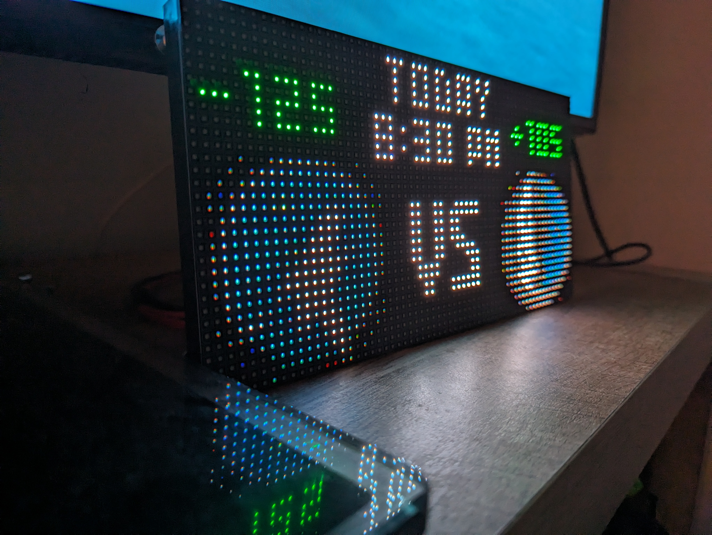

# nba-led-scoreboard


Display daily NBA action on an raspberry pi powered LED matrix. Currently supports 64x32 boards only.

### Credit and inpsiration
This project was inspired by the [nfl-led-scoreboard](https://github.com/mikemountain/nfl-led-scoreboard/) which was inspired by the [nhl-led-scoreboard](https://github.com/riffnshred/nhl-led-scoreboard), who based THEIR project off of the [mlb-led-scoreboard](https://github.com/MLB-LED-Scoreboard/mlb-led-scoreboard). Go check them out.

### Donate
<a href="https://paypal.me/kircherbrian"></a>  
If you enjoy this project, consider buying me a beer. Cheers! :beers: 

## Features (v1.0.0)

### GAME ROTATION
The display will rotate through all of the NBA action for the current day. 

### Pregame
Currently shows the team logos and tip-off time. This uses the time-zone configured for your pi. 

### Live scoring updates 
The score updates every 3 seconds. Currently, the scoreboard will display the Quarter and Time Remaining. Expect feature updates with live spreads on the road-map 

### Postgame
Looks similar to the Pre-game screen, but with the final scores. I'll get a preview in the README soon enough.

## Roadmap

Future plans include:
* Sportsbook Integrations. One of my first priorities will be to include spreads on pre-game and live scoring screens. 
* UI Improvements. I'm brand new to LED Matrix's, so I'm hoping for help from the community with tweaking the appearance of the scoreboard.
* Allow users to choose between Logos or Team Names
* Favorite Team Support: Consider this a backlog item. My use case for this board is primarily to cycle and rotate through games. However, since I'm reusing code from the NFL Scoreboard, I'll try to document and provide support to those of you who would prefer to have a fixed team or game on the display. 
* Stats: Similar to an actual sports ticker, I'd like to provide real-time stats for top scorers (etc) for each game. We already get this data from the ESPN API, so it's just a matter of how we want to display it. 

## Installation
### Hardware Assembly
The [mlb-led-scoreboard guys made a great wiki page to cover the hardware part of the project](https://github.com/MLB-LED-Scoreboard/mlb-led-scoreboard/wiki). There's also this [very handy howchoo page](https://howchoo.com/g/otvjnwy4mji/diy-raspberry-pi-nhl-scoreboard-led-panel) which is what I mainly followed.

### Software Installation
#### Raspbian Distribution
It is recommended you install Raspberry PI OS (Legacy) Lite. This version lacks a GUI, allowing your Pi to dedicate more system resources to drawing the screen.

After struggling with the installation of the NFL LED Scoreboard, I found this step to be absolutely necessary. This code does not presently support Python 3.11 which is installed in the latest versions of Raspberry Pi OS. The Legacy OS currently installs Python 3.9 which is supported. 

Make sure to set the timezone to your local timezone!

#### Requirements
You need Git for cloning this repo and PIP for installing the scoreboard software.
```
sudo apt-get update
sudo apt-get install git python-pip
```

#### Installing the software
This installation process might take some time because it will install all the dependencies listed below.

```
git clone --recursive https://github.com/bkircher/nba-led-scoreboard
cd nba-led-scoreboard/
sudo chmod +x install.sh
sudo ./install.sh
```
[rpi-rgb-led-matrix](https://github.com/hzeller/rpi-rgb-led-matrix/tree/master/bindings/python#building): The open-source library that allows the Raspberry Pi to render on the LED matrix.

[requests](https://requests.kennethreitz.org/en/master/): To call the API and manipulate the received data.

## Testing & Optimization (IMPORTANT)
If you have used a LED matrix on a raspberry pi before and know how to run it properly, then you can skip this part. 

If you just bought your LED matrix and want to run this software right away, reference the [rpi-rgb-led-matrix library](https://github.com/hzeller/rpi-rgb-led-matrix/). Check out the section that uses the python bindings and run some of their examples on your screen. For sure you will face some issues at first, but don't worry, more than likely there's a solution you can find in their troubleshooting section.
Once you found out how to make it run smoothly, come back here and do what's next.

### Adafruit HAT/bonnet
If you are using any thing from raspberry pi 3+ to the newest versions with an Adafruit HAT or Bonnet, here's what [RiffnShred](https://github.com/riffnshred) did to run his board properly. It seems these are more recommendations than things you 100% absolutely need to do, but are probably beneficial anyway.

* Do the hardware mod found in the [Improving flicker section ](https://github.com/hzeller/rpi-rgb-led-matrix#improving-flicker).
* Disable the on-board sound. You can find how to do it from the [Troubleshooting sections](https://github.com/hzeller/rpi-rgb-led-matrix#troubleshooting)
* From the same section, run the command that remove the bluetooth firmware, unless you use any bluetooth device with your pi.

Finally, here's the command he used.
```
sudo python main.py --led-gpio-mapping=adafruit-hat-pwm --led-brightness=60 --led-slowdown-gpio=3
```

## Usage

```
sudo python main.py 
```
**If you run your screen on an Adafruit HAT or Bonnet, you need to supply this flag.**
```
sudo python main.py --led-gpio-mapping=adafruit-hat
```

### Flags
Use the same flags used in the [rpi-rgb-led-matrix](https://github.com/hzeller/rpi-rgb-led-matrix/) library to configure your screen.
```
--led-rows                Display rows. 16 for 16x32, 32 for 32x32. (Default: 32)
--led-cols                Panel columns. Typically 32 or 64. (Default: 32)
--led-chain               Daisy-chained boards. (Default: 1)
--led-parallel            For Plus-models or RPi2: parallel chains. 1..3. (Default: 1)
--led-pwm-bits            Bits used for PWM. Range 1..11. (Default: 11)
--led-brightness          Sets brightness level. Range: 1..100. (Default: 100)
--led-gpio-mapping        Hardware Mapping: regular, adafruit-hat, adafruit-hat-pwm
--led-scan-mode           Progressive or interlaced scan. 0 = Progressive, 1 = Interlaced. (Default: 1)
--led-pwm-lsb-nanosecond  Base time-unit for the on-time in the lowest significant bit in nanoseconds. (Default: 130)
--led-show-refresh        Shows the current refresh rate of the LED panel.
--led-slowdown-gpio       Slow down writing to GPIO. Range: 0..4. (Default: 1)
--led-no-hardware-pulse   Don't use hardware pin-pulse generation.
--led-rgb-sequence        Switch if your matrix has led colors swapped. (Default: RGB)
--led-pixel-mapper        Apply pixel mappers. e.g Rotate:90, U-mapper
--led-row-addr-type       0 = default; 1 = AB-addressed panels. (Default: 0)
--led-multiplexing        Multiplexing type: 0 = direct; 1 = strip; 2 = checker; 3 = spiral; 4 = Z-strip; 5 = ZnMirrorZStripe; 6 = coreman; 7 = Kaler2Scan; 8 = ZStripeUneven. (Default: 0)
```

## Licensing
This project uses the GNU General Public License v3.0. If you intend to sell these, the code must remain open source and you at least have to tell people how cool I am (please, I need this).
